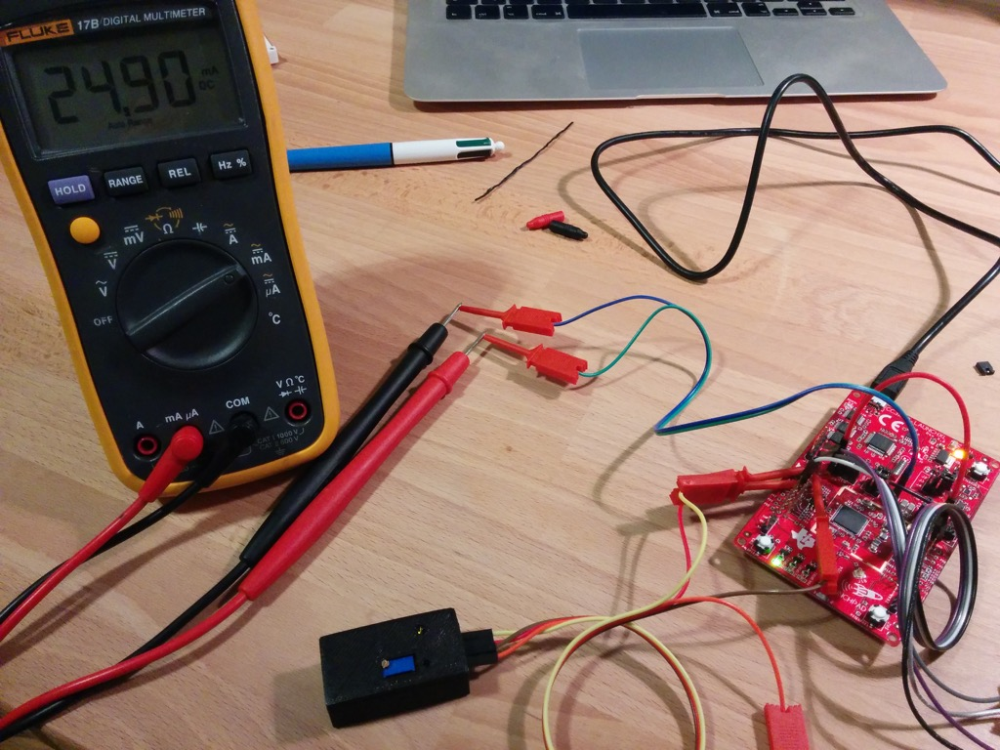

# Electricity usage monitor

To measure my electricity usage I decided to build a small system that would count LED blinks on my power meter which indicate the used Wh. It was pretty straight forward system requiring an Internet connected microcontroller to log the data and some sort of sensor that would detect LED blinks on the power meter which is not my property and thus not accessible or modifiable.

The main reason to do this project is to get a better overview of the electricity usage as the house is heated by a [heat pump](http://en.wikipedia.org/wiki/Heat_pump) so basically everything works on electricity or other free (thermal solar collector) and renewable sources (stove).

I had a [CC3200 development kit](http://www.ti.com/tool/cc3200-launchxl) laying around, it's featuring a chip with Wi-Fi and an ARM Cortex-M4 processor running at 80MHz, it was more than enough to fill all the needs of this project.

## Scope statement

Before starting I decided what the system should do and have:

* Upload data hourly to [Google Spreadsheets](https://docs.google.com/spreadsheets/)
* Count LED blinks with an edge detecting interrupt
* Allow to backlog data in case of loss of Wi-Fi connection
* Internal clock to count time (seconds)
* Synchronize internal clock with real time every day

Bonus goals:

* Make a HTTP server to view electricity usage in live
* Put the processor in low-power mode when idle

## Hardware

* Processor: for this project a [CC3200 development kit](http://www.ti.com/tool/cc3200-launchxl) was used because it has built-in Wi-Fi connectivity and all the required parts for power management, interrupt detection and timers.
* Sensor: a cheap light sensor would've been enough, but I wanted a robust edge detection. I had a [photoresistor module](http://www.dx.com/p/light-sensor-photoresistor-module-for-arduino-blue-152409) in my electronics box from a past project and it was perfect for the task as it works with 3-6V (3.3V required for the CC3200) and it has an op-amp in comparator mode and a potentiometer allowing to set the toggling threshold. It has also a LED to see the sensor state and a LED indicating if the module is powered, all on a neat PCB.

## Electronics

Aside from the CC3200 and the light sensor module all the project needed was a 5V source to power the CC3200 and a cable between the CC3200 and light sensor module. I used a USB phone charger I had laying around (do not buy those from eBay/DX... [they're dangerous](http://www.righto.com/2012/10/a-dozen-usb-chargers-in-lab-apple-is.html)) and made the other cable with an old and bad-quality USB cable, but it works well for low-power applications such as this one.

I wanted to have the light sensor fixed on the power meter, but without having to modify it or somehow glue to the module on since it's not my property. The solution was to 3D-print a small sensor enclosure that would hold the sensor right where it needs to be over the LED and fix the enclosure with cable ties on top of the power meter. Since the enclosure was so small and an easy task I used [Google Sketchup](http://www.sketchup.com/) to make it and the [STL exporter add-on](https://extensions.sketchup.com/en/content/sketchup-stl) to get the 3D printable file.

## Software

### CC3200

I decided to use [Energia](http://energia.nu/) to program the CC3200 because I'm not familiar with 32-bit processors and Code Composer Studio has quite a steep learning curve which would've made this project much longer. Arduino-style code is incredibly simple and perfect for a project like this where time is more important than a robust and well designed code, all the low-level and processor specific stuff is taken care of by the libraries and developing time for the first prototype becomes almost nothing.

Wi-Fi is not simple, fortunately for me there were examples on how to set up an Internet connection, configure an edge detector interrupt and make a request to an NTP server to retrieve the current timestamp. All that was required was to make the rest of the scaffolding, request to submit data to a Google Spreadsheet and a timer to count seconds so that the system would be able to count seconds in order to submit data every hour with the right timestamp.

#### Clock

Setting up the timer was not easy, the ARM Cortex-M4 being quite an advanced processor doing things that seem trivial on a low-end 8-bit MCU are much more complicated. The datasheet says something about a 32.768kHz fed real time clock (RTC), but I wasn't able to find anything more specific and extracting usable information from the datasheet is an art of its own. I ended up with a general purpose 32-bit timer counting up to 80e6 and calling an interrupt vector, effectively making a 1 second clock on the 80MHz processor.

This is not an ideal solution, but it's one that works and this project doesn't require down-to-the-second precision. Still with this method the clock will deviate quite a bit after a while which is why the system will synchronize with a Network Time Protocol (NTP) server at midnight every day.

#### Interrupt

Setting up edge detection interrupts is just as annoying as a timer on this feature-packed processor, fortunately most of the functions that work on Arduino IDE have been implemented for the CC3200 and an interrupt is simply set up with `attachInterrupt()`.

Sensor debounce was a big issue, for some reason the commutation had lots of noise triggering the interrupt vector 2 or more times every time. I tried to add a 100nF capacitor between the signal and ground which smoothed it well, but then it behaved even more strangely... in the end software debounce with a delay of 200ms after a rising edge was the way to go.

#### GET request

I wanted to save data to a Google spreadsheet so that I'd have access to it from anywhere in the world and also because Google data centers are probably very robust, but I did not want to use the example that was specifically made for this on Energia as it used [Temboo](https://www.temboo.com/) which requires my Google account credentials. Instead I opted for a system where I'd make a GET request and take care of data validation and formatting with Javascript on the Google Apps side. Little did I know Google required SSL and it was everything but easy to set up. Fortunately the [latest WiFi libraries for the CC3200](https://github.com/energia/Energia/tree/master/hardware/cc3200/libraries/WiFi) can do SSL requests. This makes the code on the CC3200 minimal and allows much more flexibility with Javascript on Google Apps side.

#### Server

I wanted to add a HTTP server on the CC3200 as well to view the backlogged data, live consumption over the last 10 seconds and such, but it kept crashing for some reason (locking up) and since it was more of a gimmick I left it out.

### Google apps

The receiving part of the system is written as a Google Apps script doing data validation and formatting. It's written in Javascript, something I'm very familiar with and enjoy writing code in. Nowadays Google Spreadsheets is a really powerful tool if you know how it use it, it's extremely flexible and yet free allowing to make projects like this one.

In order to be able to transmit the GET requests without having to disclose one's Google account credentials the script must be published and accessible by anymore, even anonymous. That might sound as a insecure thing to do, but one must know the specific Google spreadsheet ID which is a long, very-hard-to-guess, string.

When submitting the GET request to Google it responds with a `320: Moved Temporarily` "error" even though the URL is right, this can be ignored as data goes through.

Another peculiarity of this side of the project is that if you want to update the publicly accessible code (the one called by the CC3200) you need to publish a new version each time with *File->Manage versions* and then *Publish->Deploy as web app...*.

## Conclusion

I'm quite happy with the current state of the system as it took only about one week from idea to results. This gives me a much better idea on my power consumption than what my electricity supplier is giving me (a simple number in kWh) and what it's costing me (different rates for day and night/weekends).

The end result is neatly enclosed and aside from the sensor being on top of the power meter the system is tucked away in a safe place inside the power cable raceway which was big enough to accommodate the CC3200.

Something that would've liked to do, if I had the time, is to clean up the code and make the CC3200 go in to hibernate mode instead of idling at 20-30mA, this would've made it consume about two orders of magnitude less power.

I didn't have the patience to make the server part work without crashing the system. If the server is running the system cannot use the hibernate mode so that would've been a good excuse for the previous point...
